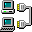
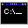

<h1 align="center">42 Cursus Archive</h1>

<table align="center">
  <tr>
    <td><b>info.txt</b></td>
  </tr>
  <tr>
    <td>
      Projects completed during the 42 Lausanne Common Core, in curriculum order. 
      From C, Unix and algorithms to C++, networking, containers and full-stack development.
    </td>
  </tr>
</table>

 

<table align="center">
  <tr>
    <td colspan="2"><b>~/projects-42</b></td>
  </tr>
  <tr>
    <td width="56" align="center"></td>
    <td><a href="https://github.com/andyst-dev/libft-42"><b>libft-42</b></a> Reimplementation of the C standard library: string and memory functions, character checks, conversions and linked lists. The base every later C project links against.</td>
  </tr>
  <tr>
    <td width="56" align="center"></td>
    <td><a href="https://github.com/andyst-dev/ft_printf-42"><b>ft_printf-42</b></a> Reimplementation of <code>printf</code>: format string parsing, variadic arguments and one small function per conversion instead of a single large one.</td>
  </tr>
  <tr>
    <td width="56" align="center"></td>
    <td><a href="https://github.com/andyst-dev/get_next_line-42"><b>get_next_line-42</b></a> Line-by-line buffered reader built on a static remainder with a configurable buffer size, working on files and multiple descriptors.</td>
  </tr>
  <tr>
    <td width="56" align="center"></td>
    <td><a href="https://github.com/andyst-dev/minitalk-42"><b>minitalk-42</b></a> Client and server exchanging a message bit by bit over <code>SIGUSR1</code> and <code>SIGUSR2</code>, with an acknowledgement per message.</td>
  </tr>
  <tr>
    <td width="56" align="center"></td>
    <td><a href="https://github.com/andyst-dev/so_long-42"><b>so_long-42</b></a> Small 2D game with map validation, texture loading and keyboard event handling, on top of MiniLibX.</td>
  </tr>
  <tr>
    <td width="56" align="center"></td>
    <td><a href="https://github.com/andyst-dev/push_swap-42"><b>push_swap-42</b></a> Sort a stack using two stacks and a restricted instruction set, with the operation count measured against a target.</td>
  </tr>
  <tr>
    <td width="56" align="center"></td>
    <td><a href="https://github.com/andyst-dev/minishell-42"><b>minishell-42</b></a> Shell: tokenizer and parser, quoting and expansions, environment and exit statuses, pipes, redirections, heredocs and signal handling.</td>
  </tr>
  <tr>
    <td width="56" align="center"></td>
    <td><a href="https://github.com/andyst-dev/philosophers-42"><b>philosophers-42</b></a> Dining philosophers: one thread per philosopher, mutex-protected forks, a separate monitor thread for death detection and timing that holds up under load.</td>
  </tr>
  <tr>
    <td width="56" align="center"></td>
    <td><a href="https://github.com/andyst-dev/cub3d-42"><b>cub3d-42</b></a> Raycasting renderer: map parsing and validation, textured walls, movement and rotation producing a first-person 3D view.</td>
  </tr>
  <tr>
    <td width="56" align="center"></td>
    <td><a href="https://github.com/andyst-dev/netpractice"><b>netpractice</b></a> TCP/IP addressing and routing exercises: my settings for levels 1 to 10, plus the subject.</td>
  </tr>
  <tr>
    <td width="56" align="center"></td>
    <td><a href="https://github.com/andyst-dev/cpp_part1-42"><b>cpp_part1-42</b></a> Modules 00 to 04: classes and encapsulation, Orthodox Canonical Form, memory management, operator overloading, inheritance and polymorphism.</td>
  </tr>
  <tr>
    <td width="56" align="center"></td>
    <td><a href="https://github.com/andyst-dev/cpp_part2-42"><b>cpp_part2-42</b></a> Modules 05 to 09: exceptions, casts, templates, STL containers and algorithms plus the larger exercises built on top of them.</td>
  </tr>
  <tr>
    <td width="56" align="center"></td>
    <td><a href="https://github.com/andyst-dev/inception-42"><b>inception-42</b></a> NGINX as the single HTTPS entry point, WordPress over php-fpm and MariaDB, each in its own container with persistent volumes and secrets-based provisioning.</td>
  </tr>
  <tr>
    <td width="56" align="center"></td>
    <td><a href="https://github.com/andyst-dev/webserv-42"><b>webserv-42</b></a> HTTP/1.1 server in C++98: request parsing, response generation, CGI execution, NGINX-style configuration parsing and multiple servers and ports on one non-blocking event loop.</td>
  </tr>
  <tr>
    <td width="56" align="center"></td>
    <td><a href="https://github.com/andyst-dev/ft_transcendence-42"><b>ft_transcendence-42</b></a> Full-stack single-page application built around online Pong: accounts and authentication, a chat service over sockets, tournaments and matchmaking, nginx in front, plus ELK and Prometheus/Grafana in the stack.</td>
  </tr>
</table>
